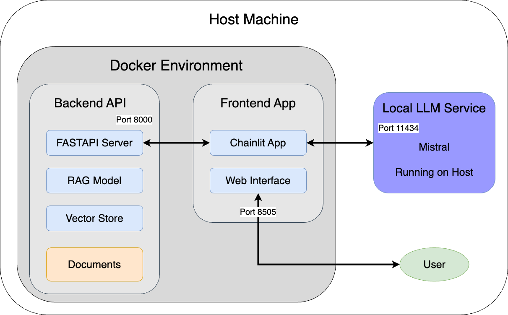

# RAG Chatbot (Python Fullstack template)

A RAG (Retrieval Augmented Generation) based question-answering prrof-of-concept (PoC) system that allows a user to query target documents using natural language. The system uses local LLMs through Ollama for privacy and performance and provides a chat interface for easy interaction. The entire codebase (both backend and frontend are developed using Python3.10).

## 🌟 Features

* Local LLM Integration: Uses Ollama for running models locally, ensuring data privacy
* Vector Search: Efficient document retrieval using FAISS
* Modern Chat Interface: Built with Chainlit for a smooth user experience
* Containerized Services: Easy deployment with Docker Compose
* Async Processing: Built with FastAPI for high performance

## 🔧 System Architecture
```
        
User ───────────────▶ Chainlit UI       Documents (txt/md/pdf)
                           │                     │
                           │                     │
                    Query  │                     │ Retrieve
                           │                     │ Documents
                           ▼                     ▼
                       FastAPI ◄───────────  RAG Model ◄─────── Local Ollama
                       Backend                   │
                           │                     │
                           └─────────────────────┘
                                Return Answer
```

## 🚀 Getting Started
### Prerequisites

* Docker
    * **Linux**: Follow the official Docker documentation for your distribution.
    * **Windows**: Download and install Docker Desktop for Windows.
    * **MacOS**: Download and install Docker Desktop for MacOS.
* Docker Compose
* Ollama (for local model running)
* Python 3.10+


### Set-up
#### Install Ollama
* Install Ollama locally (for **Mac**): 
  ```bash
  brew install ollama
  brew services start ollama
  ```

* Install Ollama locally (for **Linux**): 
  ```bash
  curl -fsSL https://ollama.com/install.sh | sh
  ```

* Install Ollama locally (for **Windows**): 
Download and install Ollama from the official Ollama website.

#### Next Steps
* Download required models: 
  ```bash
  ollama run mistral
  ollama run nomic-embed-text
  ```

* Clone the repository:
  ```bash
  git clone  https://github.com/1904Anshu/RAG_Chatbot.git 
  cd rag-chatbot-python-fullstack-template
  ```

* Configure .env file (check details at the **Configuration** section below)

* Start the services:
  ```bash
  docker-compose build
  docker-compose up -d
  ```

* Stop the services:
  ```bash
  docker-compose down
  ```

### Usage

* Access the chat interface at http://localhost:8505
* Keep your files under the documents directory
* Start asking questions about your documents!

## 🏗️ Project Structure
```
rag-chatbot-python-fullstack-template/
├── backend/
│   ├── model.py          # RAG model implementation
│   └── api.py            # FastAPI backend
├── frontend/
│   └── app.py            # Chainlit chat interface
├── docker/
│   ├── backend.Dockerfile
│   └── frontend.Dockerfile
├── requirements/
│   ├── backend_requirements.txt
│   └── frontend_requirements.txt
├── documents/            # Put/organize your documents here
│   ├── test_file_1.txt 
│   └── test_file_2.md
├── .env.example          # Example file, rename to .env
├── .gitignore
├── docker-compose.yml    # Service orchestration
├── requirements.txt      # Python dependencies as a whole (not needed)
├── chainlit.md          # Chainlit configuration
└── README.md
```

## System Diagram


## 🔒 Security

* All processing is done locally through Ollama
* No data leaves your infrastructure
* Authentication can be added as needed


## 🛠️ Configuration
* Don't forget to rename the .env.example file to .env
* Also add your own secret key.

#### Environment variables (.env):
* OLLAMA_URL=http://localhost:11434
* CHAINLIT_AUTH_SECRET=your-secret-key

#### Notes
To generate a CHAINLIT_AUTH_SECRET for your .env file, you can use the following command:
```bash
openssl rand -hex 32
```

This command uses OpenSSL to generate a secure random 32-byte hexadecimal string, which is suitable for use as an authentication secret. After running this command, you'll get a string that looks something like:
```
3d7c4e608f6df9a0e3e3ded3f1c3f384b9b3a9f9e5c1a0e2b4a8d1e0f2c3b4a7
```

You would then add this to your .env file:
```
CHAINLIT_AUTH_SECRET=3d7c4e608f6df9a0e3e3ded3f1c3f384b9b3a9f9e5c1a0e2b4a8d1e0f2c3b4a7
```

For Kubernetes, you'll need to encode this value as base64 before adding it to your secrets.yaml file:
```bash
echo -n "3d7c4e608f6df9a0e3e3ded3f1c3f384b9b3a9f9e5c1a0e2b4a8d1e0f2c3b4a7" | base64
```
Then use the resulting base64 string in your Kubernetes secrets configuration.


## Kubernetes Deployment
Added sample kubernetes config files under `kubernetes-template` folder. 
You need to modify values before production usage.
Read the [Deployment Steps](kubernetes-template/README-kubernetes.md) guide for details.


## 🤝 Contributing

* Fork the repository
* Create your feature branch (git checkout -b feature/amazing-feature)
* Commit your changes (git commit -m 'Add amazing feature')
* Push to the branch (git push origin feature/amazing-feature)
* Open a Pull Request

## 📝 License
This project is licensed under the MIT License - see the LICENSE file for details.


## 🙏 Acknowledgments

* Ollama for local LLM support
* LangChain for RAG implementation
* Chainlit for the chat interface
* FastAPI for the backend framework
